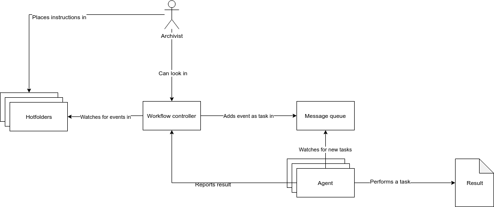

# Workflow controller

## Architecture
This is a mini framework to manage workflows asynchronous.

A workflow is a sequence of one or more ordered tasks. It consist of four components:

* A controller for workflow management
* Server message queue
* Client message queue agents
* Hotfolders for workflow generation

## Infrastructure
The entire setup consists of:

* ActiveMQ server
* Java ActiveMQ client (Camel)
* Nodejs for the workflow controller 
* MongoDB for storing temporary workflow events

## Quick start

Run the docker compose file:

    docker-compose up

## Define workflows
A workflow specifies its tasks and hotfolders and are defined config.json file.

For example:

    workflows": {
       "helloworld": {
         "mail_archivist_on_success": "archivist@localhost",
         "tasks": [
           {
             "description": "Say 'hello world 1'",
             "queue": "hello_world_1"
           },
           {
             "description": "Say 'hello world 2'",
             "queue": "hello_world_2"
           },
          "events": [
            "/data/helloworld"
          ]

This workflow is called 'helloworld'.

It has two tasks, each associated with a message queue or topic: 'hello_world_1' and 'hello_world_2'

And monitors a hotfolder: '/data/helloworld'

## Agent configuration

For each queue in the config.json@workflows.name.tasks.queue element, there is a corresponding bash queues/queuename/startup.sh script.

[Agent on github](https://github.com/IISH/workflow-pmq-agent)
